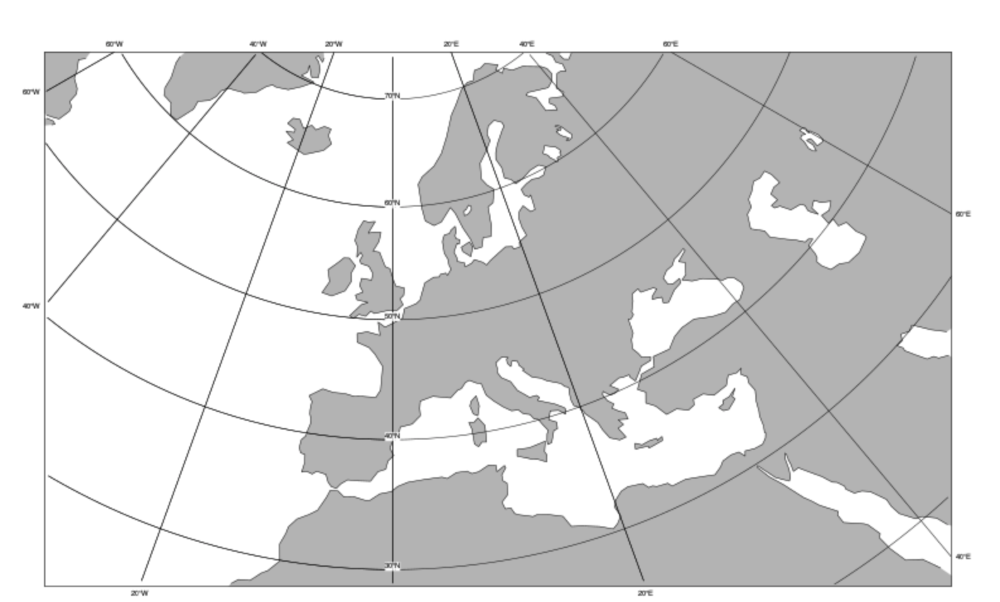

First Steps Tutorial
====================

This is an easy to follow tutorial that gets you up to speed with *magpye*
to visualise meteorological data.
It assumes you have basic Python programming knowledge.

So, let's start with plotting a simple map:

.. code-block:: python

    from ecmwf.geomaps import GeoMap
    
    geomap = GeoMap(area_name="europe")
    geomap.coastlines(land_colour="grey")
    geomap.show()

You can choose from a list of predefined areas.

